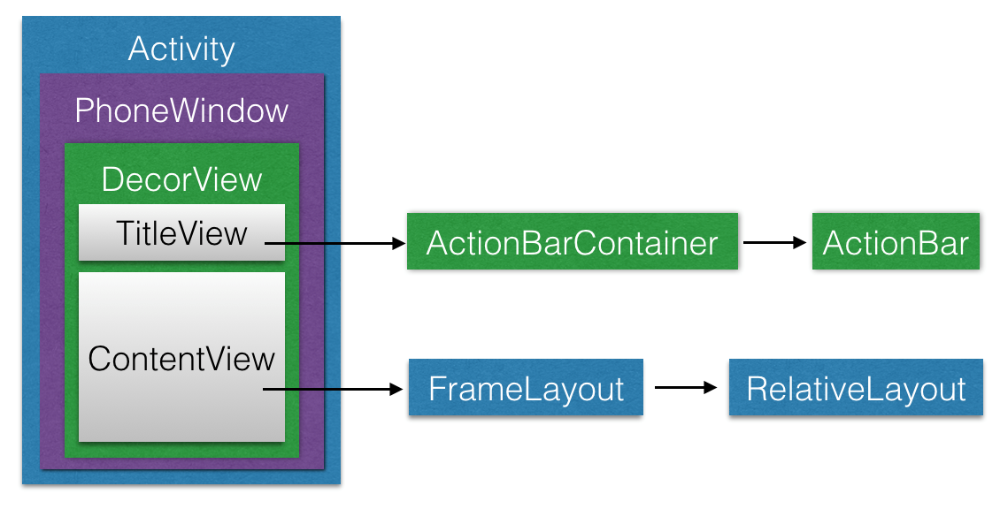

#### View 测量        
__一.MeasureSpec__   
View的测量过程中使用MeasureSpec在子View与父View之间传递测量结果。    
MeasureSpec简介：  
>1 MeasureSpec封装了父布局传递给子View的布局要求。   
 2 MeasureSpec可以表示宽和高    
 3 MeasureSpec由size和mode组成      
 
它是一个32位的int数据. 其中高2位代表SpecMode即某种测量模式，低30位为SpecSize代表在该模式下  
的规格大小     
可以通过如下方式分别获取这两个值：
获取SpecSize

    int specSize = MeasureSpec.getSize(measureSpec)
获取specMode

    int specMode = MeasureSpec.getMode(measureSpec)

当然，也可以通过这两个值生成新的MeasureSpec

    int measureSpec=MeasureSpec.makeMeasureSpec(size, mode);        

SpecMode一共有三种模式:    

模式  | 说明|
--------- | --------|
MeasureSpec.EXACTLY   | 父容器已经检测出子View所需要的精确大小。在该模式下，View的测量大小即为SpecSize |
MeasureSpec.AT_MOST   | 父容器未能检测出子View所需要的精确大小，但是指定了一个可用大小即specSize 在该模式下，View的测量大小不能超过SpecSize |
MeasureSpec.UNSPECIFIED    | 这种模式一般用作Android系统内部，或者ListView和ScrollView等滑动控件|        

__二.测量__       

View 提供给我们操作控件测量的方法是onMeasure:  

    protected void onMeasure(int widthMeasureSpec, int heightMeasureSpec) {
        setMeasuredDimension(getDefaultSize(getSuggestedMinimumWidth(), widthMeasureSpec),
                getDefaultSize(getSuggestedMinimumHeight(), heightMeasureSpec));
    }       

onMeasure的2个签名参数是由View的父View传进来的宽高的测量规格，那么根据布局层级往上 这个测量规格最开始是由根布局传入.   
但是在我们的布局文件中的最外层布局其实并不是Activity中的根布局     
[Android界面架构(Activity,PhoneWiondow,DecorView)简介](http://www.cnblogs.com/l2rf/p/6099170.html)       

由上可知在Activity中我们的根View都为DecorView,确定他最初的值是ViewRootImpl      

    private void performTraversals() {  
        // ………………  
      
        if (!mStopped) {  
            // ……
      
            int childWidthMeasureSpec = getRootMeasureSpec(mWidth, lp.width);  
            int childHeightMeasureSpec = getRootMeasureSpec(mHeight, lp.height);  
      
            // ……
      
            performMeasure(childWidthMeasureSpec, childHeightMeasureSpec);  
        }  
      
        // ………………  
    } 

    private static int getRootMeasureSpec(int windowSize, int rootDimension) {  
        int measureSpec;  
        switch (rootDimension) {  
      
        case ViewGroup.LayoutParams.MATCH_PARENT:  
            // Window不能调整其大小，强制使根视图大小与Window一致  
            measureSpec = MeasureSpec.makeMeasureSpec(windowSize, MeasureSpec.EXACTLY);  
            break;  
        case ViewGroup.LayoutParams.WRAP_CONTENT:  
            // Window可以调整其大小，为根视图设置一个最大值  
            measureSpec = MeasureSpec.makeMeasureSpec(windowSize, MeasureSpec.AT_MOST);  
            break;  
        default:  
            // Window想要一个确定的尺寸，强制将根视图的尺寸作为其尺寸  
            measureSpec = MeasureSpec.makeMeasureSpec(rootDimension, MeasureSpec.EXACTLY);  
            break;  
        }  
        return measureSpec;  
    }  